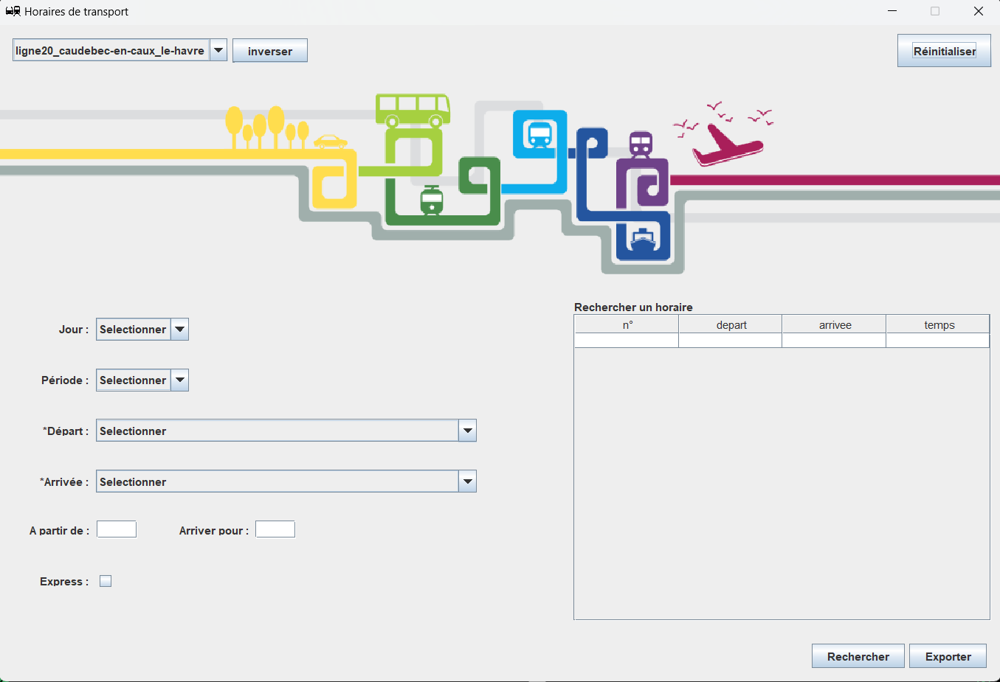

# Horaire Transport

## I - Général

**HoraireTransport** est une application permettant de consulter ses horaires pour ses différents transports au quotidien.
Elle peut être utilisée pour le bus, le train, le métro, ferry ou **tout autre moyen de transport** selon vos besoins.
Vous pouvez choisir les horaires parmis celles déjà disponibles (**ajout possible**, voir section *"Ajouter des horaires de transport"*).
Vous pourrez connaitre les heures disponibles entre deux arrets, il est possible d'y ajouter des contraintes (comme le jour, la période ou des heures...).

* * *

## II - Comment utiliser

### 1. Requierements

* java-jdk 17 [installation](...)

### 2. Compiler

Dans un terminal linux ou windows :

1. Aller au repertoire : ``./HoraireTransport/``
2. Compiler le projet : ``javac "@compile.list" "@option.list"``

	(ou ``javac .\transport\ihm\*.java .\transport\metier\filtres\*.java .\transport\metier\*.java .\transport\Controleur.java -d class\``)

### 3. Exécuter

Dans un terminal au repertoire ``./HoraireTransport/class/`` :

``java transport.Controleur``

### 4. Utilisation

1. Choisir un des fichiers pour les horaires dans la barre en haut.
2. Selectionner un lieu de départ
3. Selectionner un lieu d'arrivée
4. Cliquer sur "Rechercher"

(facultatif) Contraintes
1. Jour : lundi - dimanche ou férié
2. Période : TA (Toute l'année), PS (Période Scolaire), VS (Vacance Scolaire), ETE (Vacance d'été)

Autres options
* Rechercher : trouver les horaires correspondant aux contraintes choisies
* Inverser : inverse le lieu de départ et d'arrivée (et le fichier correspondant) *Attention : peut ne pas fonctionner*
* Réinitialiser : Enlève toutes les saisies
* Exporter : exporter au format CSV les données affichées

* * *

## III - Ajouter des horaires de transport

*info : L'ajout de fichier est détectée automatiquement.*

### 1. Format utilisé

Format : ``.csv``

Données sous forme de tableau avec données séparées par des virgules.

*Attention :*
- chaque ligne doit contenir le même nombre de colonnes
- les valeurs sont séparées par des virgules ","
- si plusieurs valeurs dans une seule case, utiliser un point virgule ";"
- nécessite au minimum 4 lignes (en tête + 2 arrets) et 2 colonnes (en tete + 1 horaire)

* 1ere ligne : ``date,d,d,d``
	le mot "date" puis le numéro correspondant au jour de la semaine pour chaque horaires (si plusieurs jours, séparer par un point virgule ";")
* 2e ligne : ``periode,p,p,p``
	le mot "periode" puis la periode correspondante (si plusieurs periodes, séparer par un point virgule ";")
* à partir de la 3e ligne : ``nom_de_l_arret,h,h,h``
	le nom de l'arret puis les heures correspondantes

### 2. Valeurs autorisées

date
* lundi au dimanche : ``1``,``2``,``3``,``4``,``5``,``6``,``7``
* jour férié : ``ferie``

periode
* toute l'année : ``ta``
* période scolaire : ``ps``
* vacance scolaire : ``vs``
* vacance d'été : ``ete``

nom de l'arret
* n'importe quelle chaine de caractère (virgule "," exclue)

horaire
* heure au format : ``hh:mm``
* absence d'horaire : ``|``

### 3. Emplacement

* emplacement des fichiers : ``./data/horaires/``
* format de nom (recommandé) : ``ligneX_debut_terminus.csv`` ou ``vehiculeX_debut_terminus.csv``
* les horaires vont toujours de pair ("debut-terminus" et "terminus-debut") sinon des fonctionnalités pourraient manquer

* * *

## IV - Droit d'auteur

### 1. Auteur et contributeurs au projet

- Maxime Lemoine : **projet**
	Github : https://github.com/Maximeuuu
	Email  : maxime.lemoine374@gmail.com

- Anaïs Grossier : **images et logo**

Fichier licence : ``./LICENSE``
